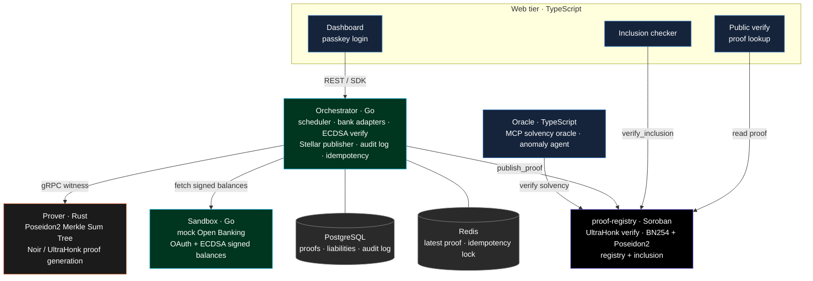

[](https://github.com/jes-labs/solva/actions/workflows/ci.yml)
[](./LICENSE)

[](https://stellar.org)
[](https://noir-lang.org)
[](https://www.rust-lang.org)
[](https://go.dev)
[](https://www.typescriptlang.org)
[](https://nextjs.org)
[](https://grpc.io)
[](https://www.postgresql.org)


Solva is a zero-knowledge Proof of Reserves protocol on Stellar. It lets a custodial institution prove that its reserves are greater than or equal to its liabilities, continuously and in real time, without revealing any individual customer balance.

A normal audit samples a few accounts, takes weeks, and ships a report that is already stale. Solva replaces that with a proof. Reserves are attested at the source through signed bank balances or on-chain holdings. Liabilities are committed into a Poseidon2 Merkle Sum Tree. A Noir circuit proves the relation `R >= L`, and a Soroban contract verifies the proof on-chain using the BN254 and Poseidon2 host functions added in Stellar Protocol 25 and 26.

The proof says nothing about who owns what. The public sees only the totals and the commitment root. Regulators can be given a viewing key for selective disclosure. Customers can check that their own balance is included in the committed tree.

## Why both sides of the balance sheet

Proving that you hold assets is not the same as proving you are solvent. A reserve figure can look healthy while the liabilities owed to customers are larger.

```
Proof of Solvency = Proof of Reserves + Proof of Liabilities
```

Most published proof of reserves systems only attest the asset side. Solva binds both sides in one proof, so the reserve total cannot hide a larger liability total.

## Architecture

Each tier uses the language that fits it. The rule that holds the system together is crypto isolation: every hash that must match the circuit lives only in the Rust prover and the Soroban contract. The Go orchestrator never hashes for the circuit. The Merkle Sum Tree is built once, in the same Rust stack that generates the proof, and recomputed on-chain by the native Poseidon2 host function. This removes any chance of a parameter mismatch between languages.



Postgres stores proofs, liabilities, and the audit log. Redis caches the latest proof and holds the per-cycle idempotency lock.

| Tier | Language | Role |
|------|----------|------|
| Circuits | Noir | Solvency, Merkle Sum, and fraud-bound constraints |
| Prover | Rust | Poseidon2 tree construction and UltraHonk proof generation |
| Contract | Rust / Soroban | On-chain proof verification, registry, inclusion check |
| Orchestrator | Go | Scheduling, bank IO, ECDSA verification, publishing, REST |
| Sandbox | Go | Mock Open Banking with OAuth and signed balances |
| Web and oracle | TypeScript | Next.js app, docs, MCP oracle, anomaly agent, SDK |

## How a proof cycle works

1. The orchestrator fetches signed reserve balances from each source and verifies the ECDSA signatures.
2. It loads the customer liabilities for the tenant from Postgres.
3. It sends reserves, liabilities, and the previous reserve total to the prover over gRPC.
4. The prover builds the Poseidon2 Merkle Sum Tree, generates the Noir/UltraHonk proof, and returns the proof, the public inputs, and the serialized tree.
5. The orchestrator publishes the proof to the Soroban `proof-registry` contract, which verifies it on-chain and stores the root and totals.
6. The proof and tree are persisted to an append-only audit log. The latest proof is cached in Redis.
7. The web app reads the latest proof, customers check inclusion on-chain, and the oracle answers solvency queries.

## Repository layout

```
apps/        web (product app), website (marketing site), docs (Fumadocs)
services/    orchestrator (Go), prover (Rust), sandbox (Go), oracle (TypeScript)
circuits/    Noir circuits: solvency, merkle, shared lib
contracts/   Soroban proof-registry
packages/    sdk-ts, contract-bindings, shared-types, ui, brand, config
proto/       gRPC definitions for orchestrator and prover
infra/       docker-compose for Postgres and Redis
```

This is a polyglot monorepo. The proof schema, contract bindings, and shared types must stay in lockstep across the verifier, prover, orchestrator, SDK, and web app, so they live in one repository where a change to any of them is a single atomic commit.

## Getting started

You need Node 22 with pnpm, Go 1.25, Rust 1.91 with the `wasm32v1-none` target, the Stellar CLI, Nargo (Noir 1.0.0-beta.9), Docker, Just, and Buf.

```bash
pnpm install
just dev
```

`just dev` starts Postgres and Redis, compiles the circuits, and runs every service. Run `just --list` for the individual targets. The full setup guide and the workflow for contributors are in [CONTRIBUTING.md](./CONTRIBUTING.md), and the engineering standards are in [SKILL.md](./SKILL.md).

## Documentation

Protocol overview, quickstart, SDK reference, and the sandbox guide live in `apps/docs`. The cryptographic construction and the formal algorithm are in the whitepaper.

## Project status

Work in progress, built for the Stellar Real-World ZK hackathon and the SDF grant track. The target chain is Stellar Testnet for the MVP and Mainnet for production. Open work is tracked in the repository [issues](https://github.com/jes-labs/solva/issues).

## Contact

Questions, partnerships, or press: [support@joinsolva.xyz](mailto:support@joinsolva.xyz).

## License

Apache-2.0. See [LICENSE](./LICENSE).
